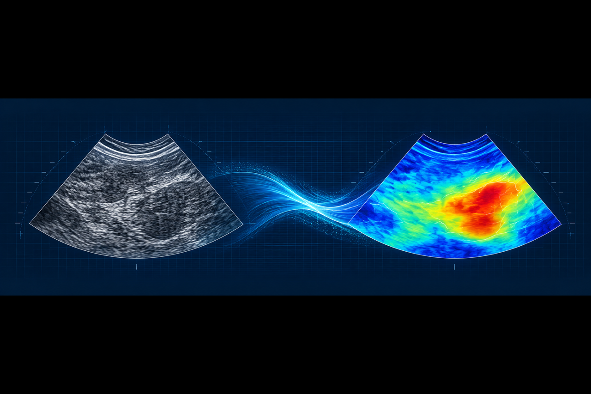
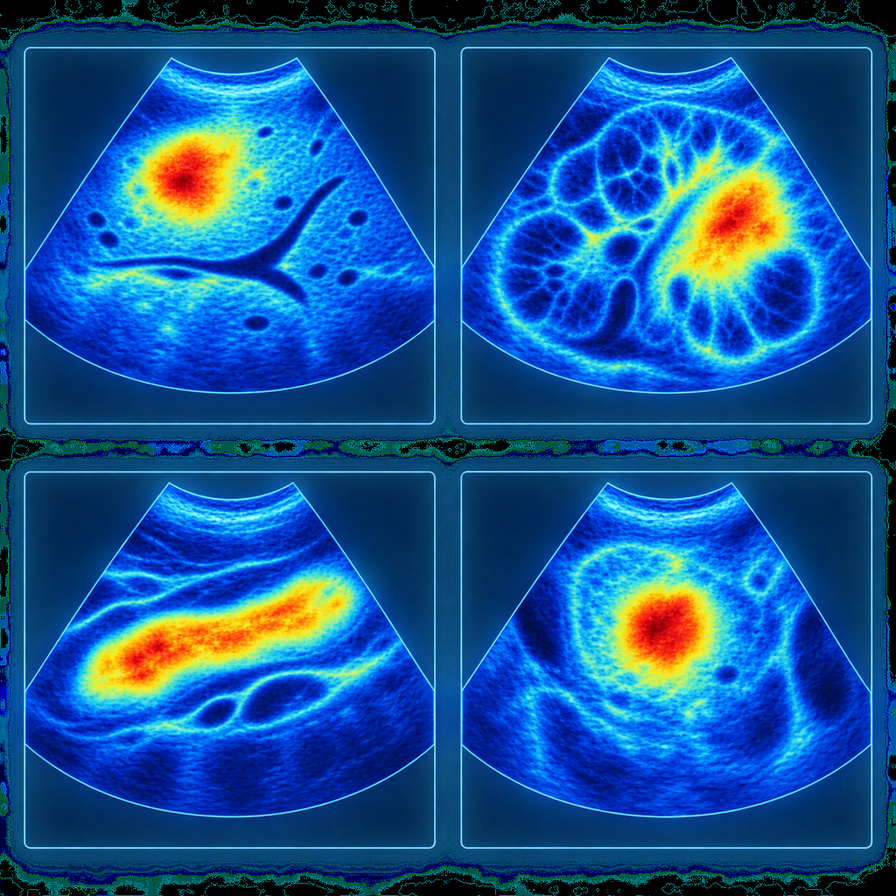
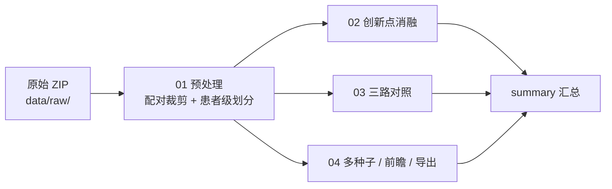

<div align="center">



# 灰阶超声 → 虚拟 SWE 与 Emean 预测

**返修实验代码 · 患者级划分 · 可复现流程**


</div>

> 这是一个**只发布代码与方法文档**的公开仓库：不包含患者数据、模型权重或实验结果文件。

## 项目简介



本项目研究"用灰阶超声生成虚拟 SWE 图像、并预测杨氏模量 Emean"的返修实验：
所有内部数据按**患者级**互斥划分，评价同时给出图像级与患者级结果。

| 预处理与划分 | 创新点消融 | 多路对照 | 队列评价 |
|---|---|---|---|
| ZIP 解压、ROI 裁剪、灰阶/弹性配对、患者级划分 | I1 FEM / I2 预训练 / I3 Emean 分支 / 全开 | 灰阶直接回归 · 全流程 · 真实 SWE 回归 | 多种子重复 · 独立外部队列 · 前瞻灰阶推断 |

<br clear="right">

<details>
<summary>目录</summary>

- [这个仓库有什么 / 没有什么](#这个仓库有什么--没有什么)
- [数据准备](#数据准备)
- [环境](#环境)
- [目录结构](#目录结构)
- [运行顺序与输入输出](#运行顺序与输入输出)
- [模块自检](#模块自检)
- [技术说明](#技术说明)
- [隐私与数据声明](#隐私与数据声明)

</details>

## 这个仓库有什么 / 没有什么

**有**：数据预处理与患者级划分、四个创新点消融、三路 Emean 对照、多种子重复、
独立外部队列评价、前瞻灰阶推断、逐图/患者级导出与汇总的全部代码。

**没有**（见 `reference/README.md`）：

- 原始数据（数据包需自备，放 `data/raw/`）
- 模型权重（含 `map2sat.pth` 预训练权重）
- 任何实验结果数值（预测 CSV、指标 JSON 等全部被 `.gitignore` 排除）
- 基线稿件与旧项目代码

## 数据准备

```bash
export MEDICAL_IMAGE_ROOT=/path/to/医疗图像     # 默认 /root/autodl-tmp/医疗图像
# 把数据包放到 $MEDICAL_IMAGE_ROOT/data/raw/，文件名见 common/paths.py：
#   数据发送2026.8.9(1).zip            （肾脏建模/外部验证/胰腺/腮腺/颌下腺）
#   第四部分前瞻性灰阶预测9.6.zip       （肾脏前瞻队列，仅灰阶，已裁剪 ROI）
#   肝脏.zip                            （肝脏补充实验）
```

标签表只有 `ID, Emean` 两列（**没有患者列**），`patient_id` 由文件名解析得到，
规则见 `common/split.py::patient_id_from_name`。

## 环境

```bash
pip install -r requirements.txt
```

## 目录结构

```
common/                      唯一来源：路径、预处理、划分、模型、指标、训练回调
experiment/<器官>/
  01_data_processing/        解压 → ROI 裁剪 → 灰阶/弹性配对 → 患者级划分
  02_ablation/               四个创新点消融（I1 FEM / I2 预训练 / I3 Emean 分支 / 全开）
  03_comparison/             三路对照：灰阶直接回归 / 全流程 / 真实 SWE 回归
  04_other/                  多种子、外部预训练消融、前瞻推断、导出
experiment/summary/          汇总所有逐图预测
```



## 运行顺序与输入输出

| 步骤 | 输入 | 输出 |
|---|---|---|
| `01_data_processing/00_preprocess.ipynb` | `data/raw/*.zip` | `cache/pairs_all.csv`、`pairs_seed_42.csv`、`patient_mapping.csv`、`split_summary.csv`、`excluded.csv`、`crop_mismatch.csv`、`external_*.csv` |
| `02_ablation/01..04` | `cache/pairs_seed_42.csv` | `<实验>_generator.pt`、`<实验>_emean_head.pt`、`metrics_<实验>.json`、逐图/患者级指标 CSV、`*_epoch_metrics.csv` |
| `03_comparison/01..03` | 同上 | `metrics_gray_direct.json`、`metrics_full_pipeline.json`、`metrics_real_swe.json` |
| `04_other/01_five_seed_repeats.ipynb` | `cache/pairs_all.csv` | `five_seed_metrics.csv`、`five_seed_mean_sd.csv` |
| `04_other/02_external_pretraining_ablation.ipynb` | 同上 + `map2sat.pth` | `external_pretraining_ablation_{by_seed,mean_sd}.csv` |
| `04_other/03_prospective_grayscale_prediction.py` | 前瞻队列目录 + 权重 | `predicted_emean.csv`、虚拟 SWE 图、`prediction_manifest.json` |
| `04_other/04_export_split_outputs.ipynb` | 训练好的权重 | `patient_level_exports/<split>/predicted_emean_*.csv` |
| `summary/00_collect_all_experiment_results.ipynb` | 上面的导出 | `metrics_summary.csv`、`metrics_summary_liver.csv`（单独） |

运行顺序：`01 → 02 → 03 → 04 → summary`。所有 Notebook 从**仓库根目录**启动 Jupyter
即可，路径由 `common/paths.py` 统一解析（支持 `MEDICAL_IMAGE_ROOT` 覆盖）。

## 模块自检

不训练也能跑的自检（每个模块自带 `_demo`，失败会直接抛异常）：

```bash
python3 -m common.preprocess                  # 配对对齐判定、交集回退、内缩代价
python3 -m common.metrics                     # 内区指标、患者级聚合
python3 -m common.train                       # EpochRecorder 两种钩子与参数校验
```

## 技术说明

| 项目 | 说明 |
|---|---|
| 几何形变 | ROI 以约 1.43:1 拉伸到 256×256（灰阶/弹性一致拉伸，成对指标自洽），虚拟图不能直接回贴临床坐标 |
| 两套模型规模 | 主实验 `base_channels=64`（54.41M 参数）；前瞻与肝脏用窄通道变体 `base_channels=16`（3.41M），已参数化（`common/models.py`） |
| 指标口径 | CoY = 阈值 0.5 的二值 Yule's Q（另提供阈值 IoU 版 `coy_iou`）；MAPE 分母下限 1/255；PSNR 上限 99；FID 为 pytorch-fid 标准定义 |
| 边界参考指标 | `metrics.py` 提供 `inner_*` 一套：裁掉外圈 8% 再算 MAE/RMSE/PSNR/MS-SSIM，作为边界鲁棒性参考 |
| 预训练权重未分发 | `map2sat.pth` 需自备，缺失时 `initialize_map2sat` 报可读错误（见 `reference/README.md`） |
| 患者 ID 由文件名解析 | 标签表没有患者列；解析规则为"剥掉末尾所有编号"，见 `common/split.py` |
| 前瞻队列输入 | 数据包内已裁 ROI；脚本用 `detect_roi_frame` 校验输入，未裁剪的截图会被拒绝，并把校验结果写进 `prediction_manifest.json` |

## 隐私与数据声明

仓库内**不含**任何患者数据、图像或可识别信息；所有数据、权重、预测 CSV、指标文件
均通过 `.gitignore` 排除。上传前可执行：

```bash
python3 -m compileall -q common experiment
find . -type f -size +2M          # 不应有大文件
git add -A -n | head              # 确认只提交代码与文档
```
